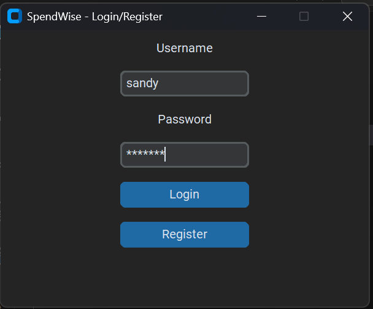
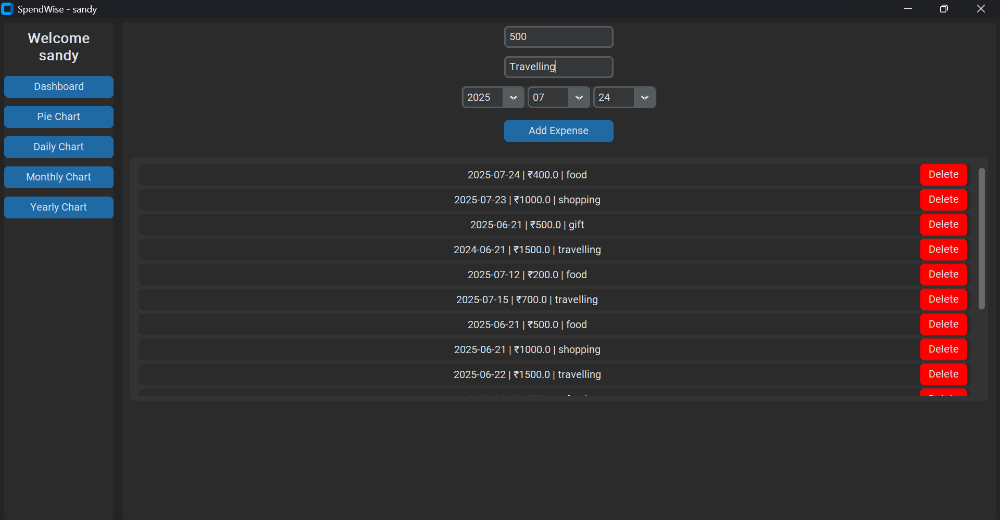
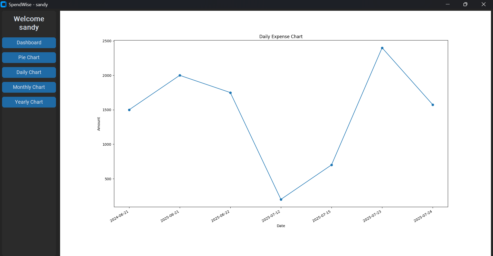
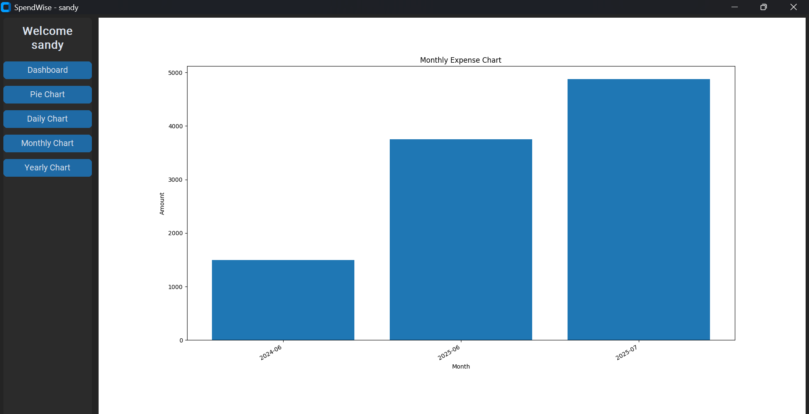
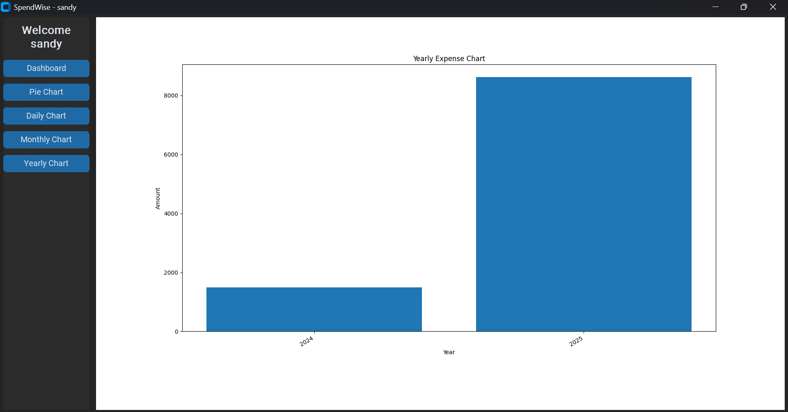

# 💸 SpendWise - Personal Expense Tracker (Tkinter + CustomTkinter)

**SpendWise** is a **desktop-based personal expense tracker** built using **Python**, **Tkinter**, and **CustomTkinter**, featuring secure login, file-based data storage, and beautiful visualizations including **Daily**, **Monthly**, **Yearly**, and **Pie** charts.

---

## 📌 Features

- 🔐 Login & Signup system with secure password hashing  
- ➕ Add expense entries with:
  - Amount
  - Category
  - Date (via Year/Month/Day dropdowns)
- 🗑️ Delete individual expense records
- 📊 Data Visualizations:
  - **Daily Chart** – View expenses by individual day
  - **Monthly Bar Chart** – Monthly spending overview
  - **Yearly Chart** – Yearly expense comparison
  - **Pie Chart** – Category-wise expense distribution
- 💾 Local file storage using CSV

---

## 📁 Project Structure

```
SpendWise/
├── charts/          # Contains generated chart images
├── data/            # Stores user data and expense data in CSV
├── images/          # UI screenshots (used in README)
├── auth.py          # Handles login and signup logic
├── dashboard.py     # Dashboard interface and logic
├── charts.py        # Chart generation functions
├── main.py          # App entry point
├── LICENSE          # MIT License
└── README.md        # Project documentation
```

---

## 🛠 Setup Instructions

### 🔧 Requirements

- Python 3.11.x  
> ⚠️ **Note:** CustomTkinter **does not support Python 3.13 or later.**

### 📦 Install Dependencies

```bash
pip install customtkinter matplotlib pandas
```

### ▶️ Run the App

```bash
python main.py
```

---

## 📷 Screenshots

### 🏠 Homepage  


### ➕ Add Expense  


### 📅 Daily Chart  


### 📆 Monthly Chart  


### 📉 Yearly Chart  


### 🥧 Pie Chart  


---

## 📜 License

This project is licensed under the [MIT License](./LICENSE).

---

## 🙋‍♂️ Author

**Mehataj P S**  
- 💼 [LinkedIn](https://www.linkedin.com/in/MEHATAJ-PS)  
- 💻 [GitHub](https://github.com/MEHATAJ-PS)

---

## 🚀 Future Improvements

- 📤 Export reports to Excel / PDF  
- 💡 Budget tracking and spending alerts  
- 🌐 Web or Mobile version using Flask/React or Kivy  
